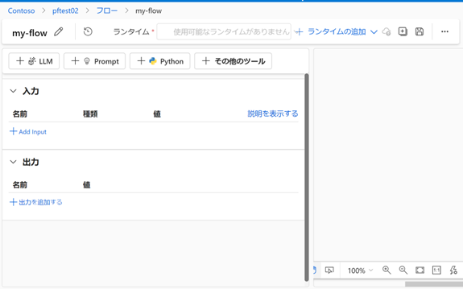

# AML プロンプト フロー (Prompt Flow) ハンズオン

ここでは、[RAG のハンズオン](https://github.com/tsmatsuz/llm-grounding) で作成したアプリケーションを Azure Machine Learning (AML) の Prompt Flow (プロンプト フロー) を使って構築します。<br>
今回、ベクトル検索で使用するデータベースとして Meta AI の FAISS (Facebook AI Similarity Search) を使用します。

> Prompt Flow 全体の機能やコンセプト等については、[Azure OpenAI Developers セミナー第 2 回](https://www.youtube.com/watch?v=cEynsEWpXdA) を参照してください。(ここでは扱いませんが、Prompt Flow では、結果の評価なども可能です。)

## Azure OpenAI Service リソースの準備

(既に作成済の方は、本項はスキップしてください。)

[Azure Portal](https://portal.azure.com) にログインします。

Azure OpenAI Service のリソースを新規作成します。<br>
gpt-35-turbo と text-embedding-ada-002 を使用しますので、どのリージョン (東日本含む) を選択しても構いません。

gpt-35-turbo と text-embedding-ada-002 を deploy します。

Azure OpenAI Service の API キーを取得します。<br>
API キーは、リソースブレードの左メニューの「Keys and Endpoint」から取得できます。

## Azure Machine Learning リソースの準備

Azure Machine Learning のリソースを新規作成します。

[Machine Learning Studio](https://ml.azure.com/) を表示します。

「プレビュー機能の管理」のアイコン (ラッパのアイコン) をクリックして、プロンプトフロー (Prompt Flow) の Preview 機能を有効化します。


## コンピューティング インスタンスの作成

このあとの FAISS インデックス作成、Prompt Flow のデバッグ実行などで、Azure Machine Learning のコンピューティング インスタンス (compute instance) を使用します。<br>
Machine Learning Studio の左メニューの「コンピューティング」を選択し、「コンピューティング インスタンス」のタブから新規作成してください。(詳細オプションは、既定の設定のまま進んでください。)

## Prompt Flow - Connection の設定

Machine Learning Studio の左メニューの「プロンプト フロー」を選択します。

「接続」(Connection) タブを選択して、上記で準備した Azure OpenAI の接続情報を追加します。


> 「API Base」には、https://{RESOURCE NAME}.openai.azure.com の形式の URL を設定します。

## Prompt Flow - FAISS ベクトル インデックスの作成

Prompt Flow を使って FAISS (Facebook AI Similarity Search) のベクトル インデックス ファイルを作成します。<br>
本作業の前に、上記で作成したコンピューティング インスタンスが実行中であることを確認してください。(作成中の場合、状態が実行中になるまで待ちます。)

> Note : ここでは Prompt Flow を使って FAISS インデックスを作成しますが、あらかじめ作成された既存のベクトル インデックスも使用できます。(FAISS のベクトル インデックスの場所を指定することで、外部のインデックスを Prompt Flow に持ち込むことができます。)<br>
> 自身でインデックス作成をおこなうことで、事前のデータ標準化 (Normalization)、Chunk 方法のカスタマイズなど細かなチューニングが可能です。

データには、[RAG のハンズオン](https://github.com/tsmatsuz/llm-grounding) で使用したデータセットと同じもの (Wikipedia の日本語コンテンツから抜粋した 1000 ドキュメント) を使用します。<br>
本リポジトリの faiss-test-data.zip (各ドキュメントの格納された 1000 ファイル) をローカルにダウンロードして解凍してください。

「ベクター インデックス」タブを選択して、下記の通り設定して、新しい FAISS のベクター インデックスを作成します。

- データソースの種類として「Local folders」を選択し、上記で解凍したディレクトリを選択してデータ (1000 個のファイル) をアップロードします。(これらのデータは、Azure Machine Learning 上にデータ アセットとして登録されます。)
- ベクトル ストアとして、今回は「Faiss インデックス」を選択します。
- 接続の選択として、上記で作成した Azure OpenAI Service の接続名を選択します。(内部で、text-embedding-ada-002 の deployment が自動で検出され、使用されます。)
- 実行するコンピューティングの種類として「コンピューティング インスタンス」を選択し、上記であらかじめて作成 (実行) したコンピューティング インスタンス名を選択します。

インデックス作成は、Azure Machine Learning のパイプライン ジョブとして実行されます。(実行状況を確認することができます。)<br>
1000 ファイルのインデックス作成には、しばらく時間がかかります。(20 分程度)<br>

> Note : 長いテキストは、自動でチャンク (Chunk) され、ベクトル化されます。(例えば、file_0.txt は、file_0.txt0, file_0.txt1 などのソース名に分割されます。)<br>
> また、この FAISS インデックスを使用したサンプルのフローも作成されます。


インデックス作成のジョブが完了すると、インデクス ファイルは Azure Machine Learning のデータ アセット (フォルダとファイル一式) として保存されます。<br>
この相対パスを取得するため、Machine Learning Studio の左メニューから「データ」を選択して、作成されたインデックスのデータ (インデックス名と同じ名前のデータです) を選択して、「探索」 (Explorer) タブをクリックして中身の詳細を表示し、下図 (赤い囲み) の相対パス名をコピーしておきます。(このパス情報は、あとで使用します。)


## Prompt Flow - フローの作成 : ①入力の定義

Machine Learning Studio の左メニューの「プロンプト フロー」を選択し、「フロー」タブをクリックします。<br>
「作成」ボタンを押して、標準フローを新規作成します。(この際、サンプルとしていくつかのステップ、入力変数、出力変数が既に含まれている場合、これらはすべて削除してください。)



上図で、「入力を追加する」(Add input) をクリックして、「```question```」という名前の文字列型の変数を追加します。<br>
また、この変数の初期値として、「```木曽川に建設された発電所のうち、1924年(大正13年)に完成したダム式の発電所は?```」の文字列を設定してください。


## Prompt Flow - フローの作成 : ②質問の Embedding

ここでは、入力された質問の Embedding (ベクトル化) をおこないます。

「その他のツール」-「Embedding」のツールを選択してステップを挿入します。<br>
「Connection」として上記で追加した Azure OpenAI の接続情報、「deployment name」に text-embedding-ada-002 の deplyment 名、「input」には上記で作成した入力変数 (```question```) を設定します。(入力結果は、下図のようになります。)


上図の右のように、入力の値と Embedding のステップが接続されていることを確認してください。(このように、ステップどうしの接続は、データの流れを表現しています。)

## Prompt Flow - フローの作成 : ③FAISS インデックスによるベクトル検索

つぎに、下記手順で、質問のベクトルに近いコンテンツを FAISS インデックスから検索します。

上記のフローに、「その他のツール」-「Faiss Index Lookup」のツールを選択してステップを挿入します。<br>
「path」には上記でコピーしたインデックスの相対パス (```/azureml/xxxxxxxx-xxxx-xxxx-xxxx-xxxxxxxxxxxx/index``` の形式のパス)、「vector」には上記の Embedding のステップの出力 (output)、「top_k」には「```5```」を入力します。


## Prompt Flow - デバッグ実行 1

ここで、下記手順で、いったんデバッグ実行をおこなって動きを確認します。

「保存」のアイコンをクリックしてフローの保存をおこないます。

デバッグ実行をおこなうコンピューティングを設定するため、「コンピューティングの追加」-「コンピューティング インスタンス ランタイム」を選択して、コンピューティング インスタンス ランタイムを追加設定します。この際、上記で作成したコンピューティング インスタンスを選択します。

なお、上記を反映するために、コンピューティング インスタンスの再起動が必要です。<br>
Machine Learning Studio の左メニューの「コンピューティング」を選択して、コンピューティング インスタンスを再起動してください。(再開するまで待ちます。)

上記の準備がすべて完了したら、フローの「ランタイム」欄で、上記で追加したランタイムを選択して、「実行」ボタンを押します。(デバッグ実行が開始されます。)<br>
デバッグ実行が終わると、下図の通り、各ステップに出力結果が表示されるので、この値を確認してください。(今回は、質問「木曽川に建設された発電所のうち、1924年(大正13年)に完成したダム式の発電所は?」に近いドキュメントが 5 つ検索されます。)


## Prompt Flow - フローの作成 : ④検索結果の加工

では、フローの続きを作成しましょう。<br>
このあと検索されたドキュメントを使って Chat Completion を実行しますが、その前に、検索結果をコンテキストとして扱えるようにデータを加工 (例: 長いテキストの切り詰め、など) する必要があります。今回は、検索結果の上位 3000 トークンに収まる範囲のアイテムに絞って、これらのコンテンツをコンテキスト文字列として使用します。<br>
こうしたカスタムな処理では、Python コードのツールを使用します。

「Python」のツールをクリックしてステップを挿入し、下記のコードを入力します。

```
from typing import List
from promptflow import tool
from embeddingstore.core.contracts import SearchResultEntity

max_len = 3000

@tool
def format_context(search_result: List[dict]) -> str:
    def format_doc(doc: dict):
        return f"コンテンツ: {doc['Content']}"

    SOURCE_KEY = "source"
    URL_KEY = "url"
    STATS_KEY = "stats"
    TOKENS_KEY = "tiktokens"

    # # sort
    # search_result = sorted(search_result, key=lambda d: d["score"], reverse=True)

    # loop and generate results
    retrieved_docs = []
    cur_len = 0
    for item in search_result:

        entity = SearchResultEntity.from_dict(item)

        content = entity.text or ""
        source = ""
        token_len = 0
        if entity.metadata is not None:
            if SOURCE_KEY in entity.metadata:
                if URL_KEY in entity.metadata[SOURCE_KEY]:
                    source = entity.metadata[SOURCE_KEY][URL_KEY] or ""
            if STATS_KEY in entity.metadata:
                if TOKENS_KEY in entity.metadata[STATS_KEY]:
                    token_len = entity.metadata[STATS_KEY][TOKENS_KEY] or 0

        cur_len += token_len
        if cur_len > max_len:
            break

        retrieved_docs.append({
            "Content": content,
            "Source": source
        })
    doc_string = "\n\n".join([format_doc(doc) for doc in retrieved_docs])
    return doc_string
```

「入力の検証と解析」ボタンを押すと、上記関数から入力と出力を自動検出します。<br>
検出された「```search_result```」の変数に、さきほど作成した Faiss Index Lookup ステップの出力結果を設定します。(入力結果は、下図のようになります。)


> Note : LangChain, Semantic Kernel を使用する際も、この Python コードのツールを使用します。接続情報として Custom Connection を使用することで、Python コード ツールから、コードを使ってこの Custom Connection を取得できます。

## Prompt Flow - フローの作成 : ⑤Chat Completion の実行

つぎに、下記手順で、作成されたコンテキストを使って Chat Completion を実行します。

「LLM」のツールをクリックしてステップを挿入します。<br>
以下を設定します。

- 「接続」には、上記で作成した Azure OpenAI の接続名を設定します。
- 「API」には、「chat」を選択します。
- 「deployment name」には、Azure OpenAI Service で展開した gpt-35-turbo の deployment 名を設定します。
- 「temprature」には、「0」を設定します。
- 「max token」には、「1024」を設定します。
- 「プロンプト」には、下記を設定します。

```
system:
OpenAI で学習された大規模言語モデルです。可能な限り日本語で答えてください。
user:
下記の取得されたコンテンツ一覧を使って、下記の質問に答えてください。
もし答えがない場合には、「私は知らない」と答えてください。

{{contexts}}

質問: {{question}}

答え:
```

「入力の検証と解析」ボタンを押すと、上記のプロンプトから入力 (今回は ```contexts``` と ```question```) を自動検出します。<br>
検出された「```contexts```」にさきほどの Python コード ステップの出力結果を設定し、「```question```」には このフロー入力 (入力変数 ```question```) を設定します。


## Prompt Flow - フローの作成 : ⑥出力 (結果) の定義

さいごに、下記手順で、Prompt Flow の出力を定義します。

「出力」欄の「出力を追加する」(Add output) をクリックして、「```resulttext```」という名前の文字列型の変数を追加します。<br>
この変数に、上記の Chat Completion のステップの出力 (output) を関連付けます。

最終的に完成したフローは下図になります。


## Prompt Flow - デバッグ実行 2

フローの保存をおこない、再度デバッグ実行をおこなって、「```大井発電所```」が答えとして返されることを確認してください。

また、入力 (変数 ```question```) の初期値を「```今日は何曜日?```」に変更して実行すると「私は知らない」と返されることも確認してください。
